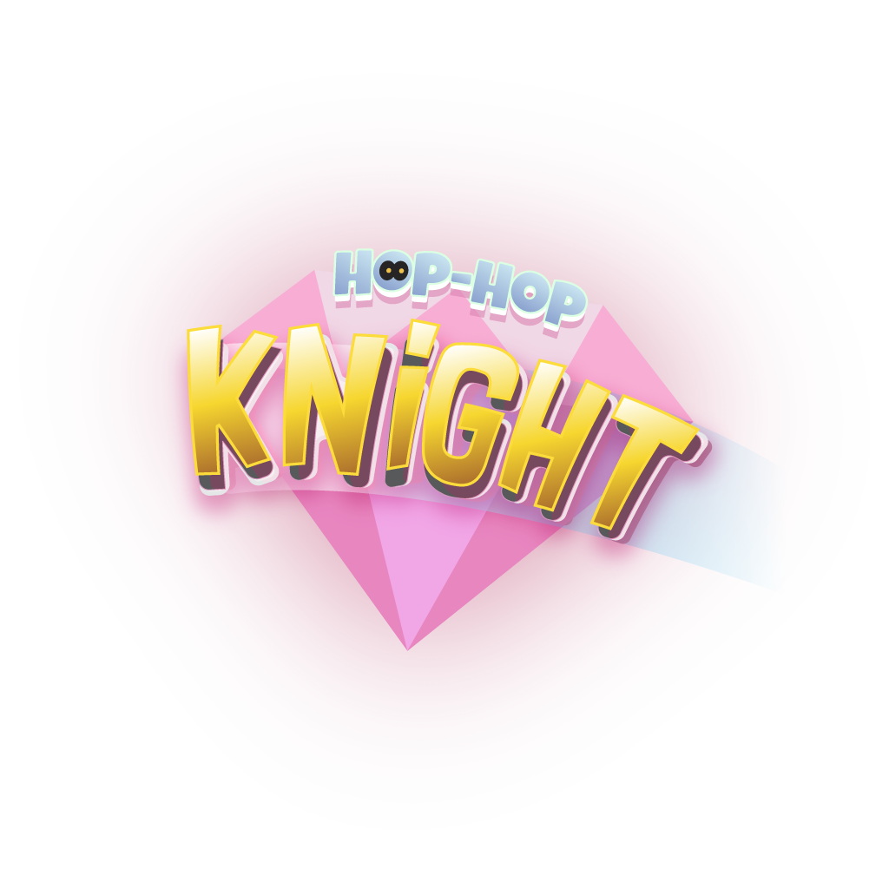

# Hop-Hop Knight

How far up can you get? Climb an endless tower, jumping through tramps while evading all sorts of enemies in Hop-Hop Knight! Try to reach higher to get a new score with the help of the marvelous pink gems, and don't forget to always keep hopping!

This is a game developed by students from <a href="https://www.imagecampus.edu.ar/">Image Campus</a>

   

## Credits

- **Mariano Martinez** - *Programming* -  
- **Josué Borgui** - *Art* - 
- **Lucia Martin** - *Art* -  
- **Leticia Pak** - *Art* -  
- **Diego Granados** - *Audio* -  
- **Matias Yudica Bartels** - *Audio* -     
- **Tomás Carceglia** - *Testing* -   
- **Nahuel Retamoso** - *Testing* -   

This game was also possible thanks to the support of these professors:

- **Sergio Baretto**
- **Federico Barra**
- **Jorge Cuéllar**
- **Fernando Puig**
- **Eugenio Taboada**

## Acknowledgements

We would like to thank everyone who playtested our game during "Nucleo".

## Links

Download it from itch.io: https://mbpmm.itch.io/hop-hop-knight
